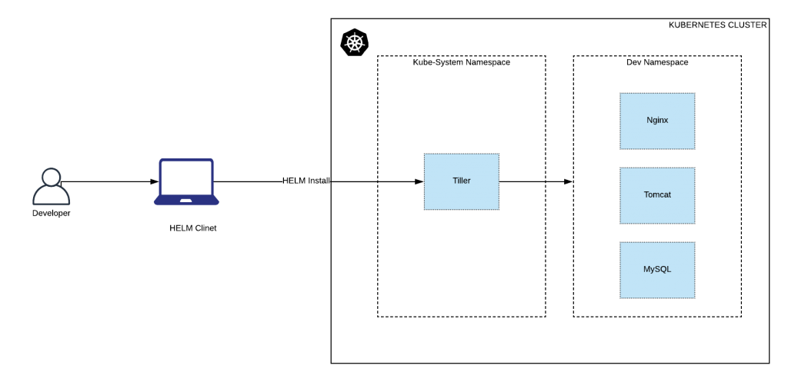

# How To Install and Configure Helm

* Helm Architecture



* Installing helm [Client]

This installation is on the client side. ie, a personal workstation, a Linux VM, etc. You can install helm using a single liner. It will automatically find your OS type and installs helm on it.

Execute the following from your command line.

```
curl -L https://git.io/get_helm.sh | bash

```

* Create Tiller Service Account With Cluster Admin Permissions

Tiller is the server component for helm. Tiller will be present in the kubernetes cluster and the helm client talks to it for deploying applications using helm charts.

Helm will be managing your cluster resources. So we need to add necessary permissions to the tiller components which resides in the cluster kube-system namespace.

Here is what we will do,

Create a service account names tiller
Create a ClusterRoleBinding with cluster-admin permissions to the tiller service account.

We will add both service account and clusterRoleBinding in one yaml file.

Create a file named helm-rbac.yaml and copy the following contents to the file.

```
apiVersion: v1
kind: ServiceAccount
metadata:
  name: tiller
  namespace: kube-system
---
apiVersion: rbac.authorization.k8s.io/v1
kind: ClusterRoleBinding
metadata:
  name: tiller
roleRef:
  apiGroup: rbac.authorization.k8s.io
  kind: ClusterRole
  name: cluster-admin
subjects:
  - kind: ServiceAccount
    name: tiller
    namespace: kube-system

```

* Lets create these resources using kubectl

```
kubectl apply -f helm-rbac.yaml

```

* Initialize Helm: Deploy Tiller

Next step is to initialize helm. When you initialize helm, a deployment named tiller-deploy will be deployed in the kube-system namespace.

Initialize helm using the following command.

```
helm init --service-account=tiller --history-max 300

```

* You can check the tiller deployment in the kube-system namespace using kubectl.

```
kubectl get deployment tiller-deploy -n kube-system

```
* Deploy a Sample App Using Helm

Now lets deploy a sample nginx ingress using helm.

Execute the following helm install command to deploy an nginx ingress in the kubernetes cluster. It will download the nginx-ingress helm chart from the public github helm chart repo.

```
helm install stable/nginx-ingress --name nginx-ingress --set controller.publishService.enabled=true

```

* You can check the install helm chart using the following command.

```
helm ls

```

* install jenkins using helm chat 

```
wget https://raw.githubusercontent.com/helm/charts/master/stable/jenkins/values.yaml -O jenkins-values.yaml

helm install stable/jenkins --name=jenkins -f jenkins-values.yaml

```

* create nginx ingress controller for jenkins

```
# jenkins-ingress.yaml

apiVersion: extensions/v1beta1
kind: Ingress
metadata:
  name: jenkins-ingress
  annotations:
    kubernetes.io/ingress.class: nginx
spec:
  rules:
    - host: jenkins.yourdomainname.com
      http:
        paths:
          - backend:
              serviceName: jenkins
              servicePort: 8080
            path: /
```

* apply for jenkins ingress

```
kubectl apply -f jenkins-ingress.yaml

```

* jenkins user name and password 
Get your 'admin' user password by running:

```
printf $(kubectl get secret --namespace default jenkins -o jsonpath="{.data.jenkins-admin-password}" | base64 --decode);echo

```

* install grafana using helm chart 

```
helm install --name grafana stable/grafana --set=ingress.enabled=True,ingress.hosts={grafana.domain.com} --set rbac.create=true

```
* Insall prometheus using helm chart

```

helm install --name=prometheus stable/prometheus --set  alertmanager.ingress.enabled=True,alertmanager.ingress.hosts={alertmanager.domain.in} --set rbac.create=true
```

* You can delete the sample deployment using delete command. For example,

```
helm delete nginx-ingress

```

* Create helm chart:

```
helm create helm-chart

```

This will create a basic structure for helm, we need to edit a few files to make our app running.
Update image to be used in values.yaml

```
image:
repository: <your username>/<appname>
tag: latest

```

Again in values.yaml we will update the service port configuration

```
service:
type: NodePort
exposePort: 30000 // expose to node 
targetPort: 8080 // App server listening on this port
internalPort: 3000 // Internal exposed within the pod

```

Note: I am using NodePort to test running application on node.
To learn more about port type visit https://kubernetes.io/docs/tutorials/kubernetes-basics/expose/expose-intro/
We will use the above port configuration in service.yaml file

```
spec:
type: {{ .Values.service.type }}
ports:
- nodePort: {{ .Values.service.exposePort }}
port: {{ .Values.service.internalPort }}
targetPort: {{ .Values.service.targetPort }}
```

Now everything is ready.
Deploy app to cluster:

```
helm install --name <appname> helm-chart/

```

Congratulation 😃 application is successfully running on kubernetes cluster.

* Remove Helm (Tiller) From Kubernetes Cluster

If you want to remove the tiller installtion from the kubernetes cluster use the following command.

```
helm reset

```

* For some reason, if it throws error, force remove it using the following command.

```
helm reset --force

```

* Also you can use the kubectl command to remove it.

```
kubectl delete deployment tiller-deploy --namespace kube-system
```

